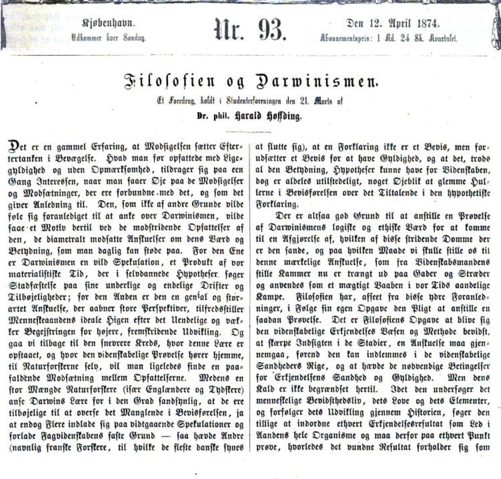

Harald Høffding's life spans a time of momentous change --- in
science, philosophy, and culture more generally. On February 20, 1843,
Kierkegaard's first book *Either-Or* was published. Just a few weeks
later, Harald Høffding was born in Copenhagen, in a house across the
street from the Kierkegaards. (Both families lived on Gammeltorv.)
Høffding was twelve years old when Søren Kierkegaard died (November
11, 1855), and might have witnessed the funeral procession from Vor
Frue Kirke. Five years later, Høffding began at the University of
Copenhagen, and here he fell under the influence of Rasmus Nielsen,
the self-proclaimed disciple of Kierkegaard.

When Høffding was forty-two years old, Niels Bohr was born in the
Adler family home on Gammel Strand, not far from where Høffding was
living at the time. Høffding lived another forty-six years, allowing
him to witness the publication of Bohr's groundbreaking trilogy
(1913), and Bohr's receiving the Nobel Prize. (Interestingly,
Høffding's lifespan overlaps significantly with Georg Brandes
(1842-1927).)

Høffding wrote several topical works where he offers his considered
opinion on matters of epistemology, ethics, etc. In contrast, he
doesn't show much interest in metaphysics --- not of the old fashioned
kind of Christian Wolff. Nor does Høffding show much interest in the
anti-metaphysical strains of the positivist movement.

## Realism

- See [Om Realisme i Videnskab og
  Tro](https://da.wikisource.org/wiki/Om_Realisme_i_Videnskab_og_Tro)

## Darwin

- <https://www.darwinarkivet.dk/arkivet/danske-reaktioner/biografier/hoeffding-harald/index.html>
- Høffding, Harald: "Filosofien og Darwinismen", Nær og fjern, vol. 3, hæfte 93, 12. april, s. 1-4 [pdf](../pdf/hoffding-darwin.pdf)
- Høffding, Harald: "Filosofien og Darwinismen", Nær og fjern, vol. 3, hæfte 94, 19. april, s. 4-7

## Antropomorfism

## Causality

- See Høffdings Psykologi.

## God's eye view

- David Favrholdt claims that Høffding was ok with the idea of a god's
  eye view of reality. But I'm not convinced of that.
- Høffding critcizes Nielsen's argument that human subjects cannot
  achieve a god's eye view of reality, but that God himself could do
  it.

## Debate with Brandes

## External resources 

- [Harald Høffdings demokratiske
  radikalisme](https://dansklitteraturshistorie.lex.dk/Harald_Høffdings_demokratiske_radikalisme)

## Primary sources 

- **Den antike Opfattelse af Menneskets Villie.** 1870.  
- **Philosophien i Tyskland efter Hegel.** 1872.  
- **Den engelske Philosophi i vor Tid.** 1874.  
- **Om Grundlaget for den Humane Ethik.** 1876.  
- **Psykologi i Omrids paa Grundlag af Erfaring.** (1882). Sjette paa ny gennemsete Udgave. 1911. → [*Outlines of Psychology*](https://www.google.dk/books/edition/Outlines_of_Psychology/baYFAQAAIAAJ?hl=en&gbpv=1&dq=Høffding+Psychology&printsec=frontcover)  
- **Formel Logik. Til Brug ved Forelæsninger.** (1884). Sjette Udgave. 1913.  
- **Etik. En Fremstilling af de etiske Principer og deres Anvendelse paa de vigtigste Livsforhold.** (1887). Fjerde, paa ny gennemsete og delvis ændrede Udgave. 1913.  
- **Psykologiske Undersøgelser.** 1889. (Videnskabernes Selskabs Skrifter).  
- **Etiske Undersøgelser.** Om Muligheden af en filosofisk Etik. — Om Velfærdsprincipet. — Forholdsloven i Etiken. 1891.  
- **Søren Kierkegaard som Filosof.** 1892.  
- **Kontinuiteten i Kants Filosofiske Udviklingsgang.** 1893. (Videnskabernes Selskabs Skrifter).  
- **Den nyere Filosofis Historie.** En Fremstilling af Filosofiens Historie fra Renaissancens Slutning til vore Dage. To Bind. (1894–95). Anden gennemsete Udgave. 1904.  
- **Jean Jacques Rousseau og hans Filosofi.** (1896). Anden Udgave. 1912.  
- **Kort Oversigt over den nyere Filosofis Historie.** (1898). Femte, paany gennemsete Udgave. 1913.  
- [**Mindre Arbejder.** Første Række.](https://da.wikisource.org/wiki/Mindre_Arbejder) 1899.  
  - [*Om Vitalisme*](https://da.wikisource.org/wiki/Om_Vitalisme)  
  - [*Om Realisme i Videnskab og Tro*](https://da.wikisource.org/wiki/Om_Realisme_i_Videnskab_og_Tro)  
- **Det psykologiske Grundlag for logiske Domme.** 1899. (Videnskabernes Selskabs Skrifter).  
- **Ved Aarhundredeskiftet.** Tale holdt paa Københavns Universitet. 1901.  
- **Religionsfilosofi.** 1901. Andet Oplag. 1906.  
- **Filosofiske Problemer.** 1902. (Universitetsprogram).  
- **Om nogle Religionsfilosofiske Arbejder fra den nyeste Tid.** 1903. (Universitetsprogram).  
- **Moderne Filosoffer.** 1904.  
- **Mindre Arbejder.** Anden Række. 1905.  
- **Danske Filosoffer.** 1909.  
- **Den menneskelige Tanke, dens Former og dens Opgaver.** 1910.  
- **Religion og Videnskab.** 1910.  
- **Udvalgte Stykker af dansk filosofisk Litteratur.** Med Indledninger af Harald Høffding. 1910.  
- **Personlighedsprincippet i Filosofien.** Stockholm. 1911.  
- **Mindre Arbejder.** Tredie Række. 1913.  
- **Henri Bergson’s Filosofi.** Karakteristik og Kritik. 1914.  
- **Den store Humor.** En psykologisk Studie. 1916.  
- **Totalitet som Kategori.** 1917.  
- **Oplevelse og Tydning.** 1918.  
- **Relation som Kategori.** 1921.  
- **Begrebet Analogi.** 1923.  
- **Erkendelsesteori og Livsopfattelse.** 1925.  
- [**Erindringer.**](https://slaegtsbibliotek.dk/923620.pdf) 1928.
- Fem essays : Om muligheden af en filosofisk Etik, Om
  Velfærdsprincippet, Forholdsloven i Etikken, Social Pessimisme,
  Demokratisk Radikalisme

## Secondary sources 

- Christiansen, F. "Heinrich Hertz's Neo-Kantian Philosophy of
  Science, and its Development by Harald Høffding."  Journal for
  general philosophy of science 37 (2006): 1-20.
- David Favrholdt
- Erik Ringdom, Samtaler med Harald Høffding 1909-1918
- Erik Ringdom, Harald Høffding: Bidrag til Biografi og Karakteristik
- Fuglsang-Damgaard, D. Harald Höffding: in memoriam
- https://www.henrikpontoppidan.dk/text/seclit/secartikler/hoeffding_harald/gensvar_GB_1890.html
