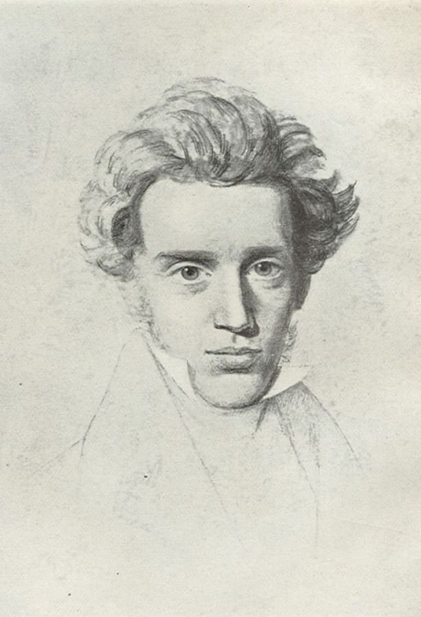
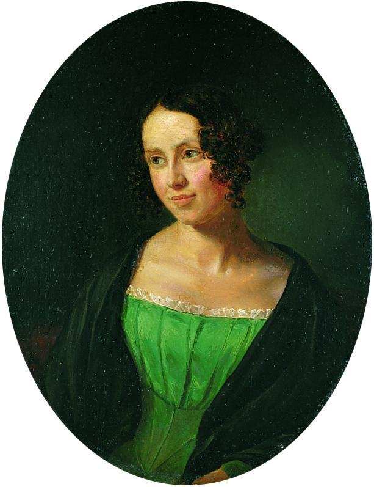
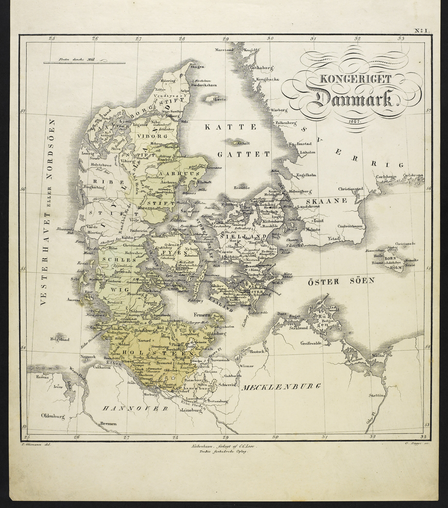
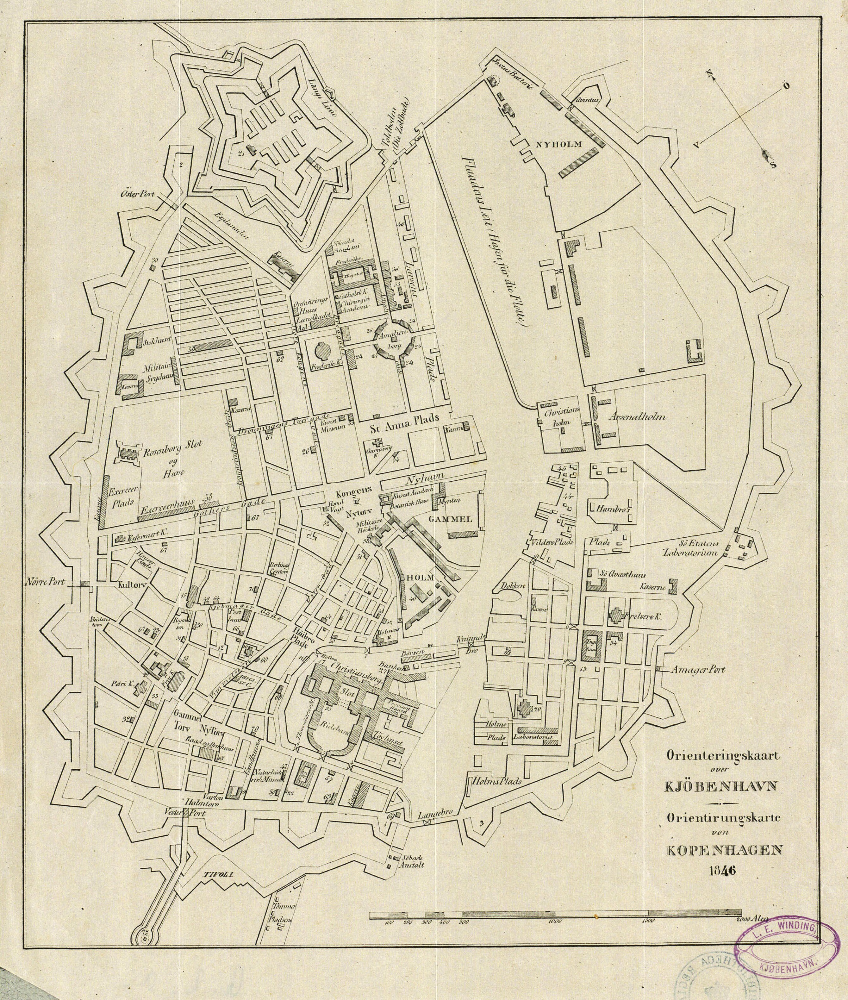
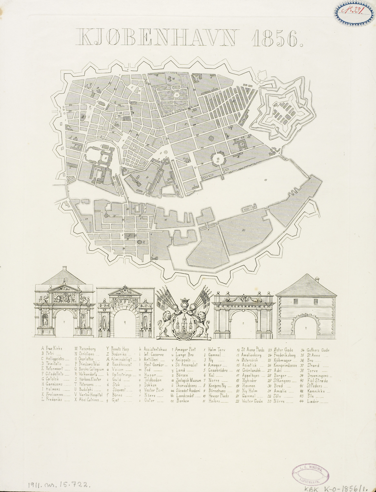

Wed, June 24

## To Do

- ~~Pictures of Kierkegaard, Regine~~ → open **[slides.html](slides.html)** in a browser (F11 for full screen; ← → or click to advance). Images live in `img/`.

## Introductions

- Introduce Søren Aabye Kierkegaard

  - Born in family house on Gammeltorv in Copenhagen: May 5, 1813
	
  - Danish
  
    - State bankruptcy (Jan 5, 1813)
	- Loss of Norway (Treaty of Kiel, Jan 14, 1814)
	- Small linguistic group (Denmark proper: 1,230,964 in 1834 and 1,414,648 in 1850; Copenhagen: 119,292 in 1834 and 129,695 in 1850)
 	  - Copenhagen was about the size that New Haven, CT is today
	  
  - Grew up in an extremely strict Christian home
	
  - Tumultuous relationship with fiancee, Regine Olsen	

  
  - Devoted self to writing
  
  - Pseudonymous authorship
  

## Logistics
  
- Presentations
- Writing assignments
- Day trips
- Contract

## What Kierkegaard has meant (first pass)

- German
  - Protestant theology
- French
  - Existentialism
- English	

## Map views

- Denmark

    

  - West Jutland
  - Copenhagen

      

      
      
      

    - Ramparts
    - University
    - Sølvgade 6
    - Lakes
    - Harbor and Bridges

## Walking tour

  - Birth: Gammel Torv
  - Childhood
    - Vor Frue Kirke = family parish, but a ruin from the 1807
      bombardment until reconsecration Whit Sunday 1829
	- University
	- Apartment in Dyrkøb
	- Apartment on Kultorvet
	- Apartment in Rosenborggade 
	- Baptized in Helligåndskirken (Church of the Holy Ghost), June 3,
      1813
	- Confirmed April 20, 1828 by J.P. Mynster (Frue-parish chaplain),
      held in Trinitatis Kirke — the Frue congregation's interim
      church while Vor Frue was rebuilt
  
## Philosophy before Kierkegaard

  - The Greeks
    - Socrates: dialogue
	- Plato: forms
	- Aristotle
  - Early modern philosophy
    - Descartes
	- Spinoza
	- Locke
	- Hume
  - German idealism
    - Kant
	- Fichte
	- Hegel

Thu, June 25

\begin{outline}[enumerate]

\1 What is Kierkegaard best known for? 

   \2 Leap of faith

	  \3 Evidentialism versus fideism

\end{outline}
