# Mission accomplished?

## Mission accomplished?

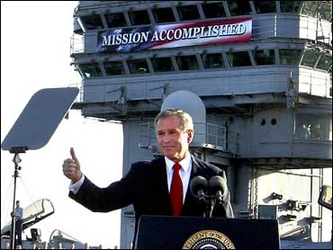{width=55% fig-align="center"}

## What was Bas' mission?

Not the doctrines --- constructive empiricism, the modal
interpretation, the semantic view, voluntarist epistemology.

\vspace{0.3cm}

Those are the *outputs*. The mission was something else:

[to make a space in which human beings can do science
as human beings.]{.alert}

## The big mission: a space of reasons

Harald Høffding helped create the intellectual culture in which Niels
Bohr was possible.

\vspace{0.2cm}

This is Bas's mission too: a [space of reasons]{.alert} --- to borrow
Sellars' own term --- in which human beings can flourish:
intellectually, creatively, scientifically.

> I do not think we need new theories in philosophy.  But ... we must
> change, or change back, the way we do philosophy --- in aid of an
> authentic, engaged project, conscious of its own limits.

## Outline 

1. Sellars' problematic 
2. van Fraassen: challenge accepted 
3. The Danish road 
4. Er musste das Wissen aufheben

# Sellars' problematic 

## Pittsburgh, circa 1963

:::: columns
::: {.column width="33%"}
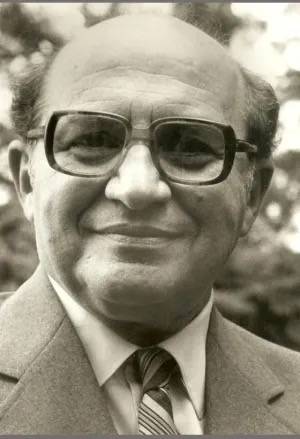{height=52%}

Grünbaum
:::
::: {.column width="33%"}
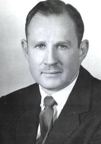{height=52%}

Sellars
:::
::: {.column width="33%"}
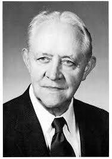{height=52%}

Kockelmans
:::
::::

*the problematic of a philosophical career is set*

## Sellars "Philosophy and the Scientific Image of Man"

> The philosopher, then, is confronted by two conceptions ... of
> man-in-the-world and he cannot shirk the attempt to see how they
> fall together in one [stereoscopic view]{.alert}.

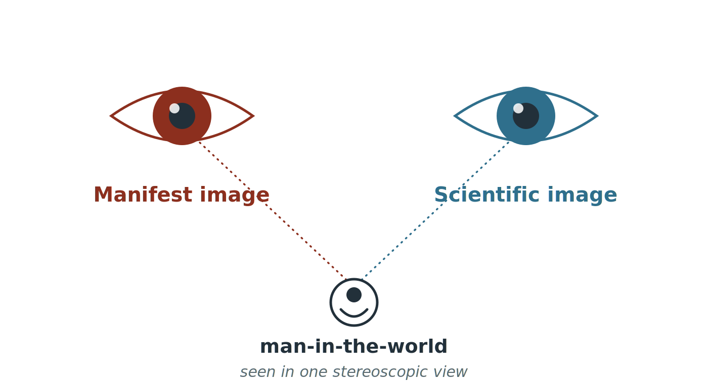{width=58%}

## The two images, felt

I cannot help experiencing time as flowing ---
the present as real, the future as open.

\vspace{0.3cm}

Special relativity appears to have no place for either:
no absolute present, no flow.

\vspace{0.3cm}

[Putnam: past and future are as real as the present.]{.alert}
The manifest "now" --- an illusion?

::: {.notes}
- The classic example is Eddington's two tables (solid/brown vs. mostly empty space) --- mention in words as the textbook case, then give THIS as the more timely, more felt one.
- Putnam, "Time and Physical Geometry" (1967): relativity of simultaneity settles a metaphysical question --- no privileged present, so past/future as real as present. Sider, four-dimensionalism: same verdict.
- These are SPINOZISTS --- using the scientific image to dissolve the manifest. The most felt, first-personal instance of "closing the circle": the present moment itself.
- Do NOT resolve here. This is the sharpest statement of the problem; whether the scientific image gets to declare the present illusory is exactly what the rest of the lecture contests.
- More vivid than Eddington: this clash is one you live inside, not one you observe from outside.
:::

## Sellars "Philosophy and the Scientific Image of Man"

> I have characterized the manifest image of man-in-the-world as the
> framework in which man encountered himself.

> What I have referred to as the 'scientific' image of
> man-in-the-world and contrasted with the 'manifest' image, might
> better be called the 'postulational' or 'theoretical' image.

## The Perennial Philosophy

> ... the manifest image endorsed as real, and its outline taken to be
> the large-scale map of reality to which science brings a
> needle-point of detail and an elaborate technique of map-reading.

> I *am* implying that the perennial philosophy is analogous to what
> one gets when one looks through a stereoscope with one eye
> dominating.

## Against the Perennial Philosophy

> I seem, therefore, to be saying ... that man is not the sort of
> thing he conceives himself to be; that his existence is in some
> measure built around error. ... One thinks, for example, of
> [Spinoza]{.alert}, who contrasted man as he falsely conceives himself
> to be with man as he discovers himself to be in the scientific
> enterprise.

## Sellars' Ambiguity

> ... the very fact that I use the analogy of stereoscopic vision
> implies that as I see it the manifest image is not overwhelmed.

> ... the first, which, like a child, says 'both', is ruled out by a
> principle which I am not defending in this chapter.

\vspace{0.3cm}

Not overwhelmed --- yet 'both' is ruled out. [Which is it?]{.alert}

## Closing the circle

"Let the scientific image account for **everything** ---
including the describer who produced it."

\vspace{0.4cm}

One mission, many names:
reduction → supervenience → grounding

\vspace{0.2cm}

[Not a drop of existentialism --- the self always comes
second to the system.]{.alert}

\vspace{0.2cm}

A mission one may choose, as Bas chose another.

::: {.notes}
- Spoken roll call, spanning centuries to show it's a perennial style, not a recent one: Spinoza, Christian Wolff, Hegel, David Lewis, the early Putnam. Not a drop of existentialism in any of them.
- The charge is NOT that they deny the self (varies --- Lewis no, Churchland yes). It is that the existing, choosing self is *deprioritized to the point of absence* --- obvious from the practice. Pure system-building; the theorist never appears in the theory.
- Lewis is the cleanest specimen: brilliant, totalizing, and the choosing self never enters the work.
:::

## Closing the circle: the programs

In physics:

**measurement problem** --- remove the observer from the quantum axioms ·
**the Mentaculus** --- the world from one probability distribution ·
**Lewis** --- everything on the Humean mosaic ·
**Field** --- science without numbers

In philosophy of mind:

**Quine** --- epistemology naturalized ·
**Churchland** --- the self as folk theory, ripe for elimination ·
**Dennett** --- the first person redescribed from the third

*the same mission, on two fronts*

## Pittsburgh, 1996

McDowell elevates Sellars' essay to the canon ---
and dissolves the dilemma: the space of reasons need be
neither reduced nor spooky.

*The courageous move --- and nearly Bas's own.*

But then the coda: ["...a naturalism of second nature."]{.alert}

To invoke second nature is to promise grounding in first nature ---
the reduction deferred, not refused. The courage is taken back.

# van Fraassen meets the challenge 

## Responses to Sellars' problem

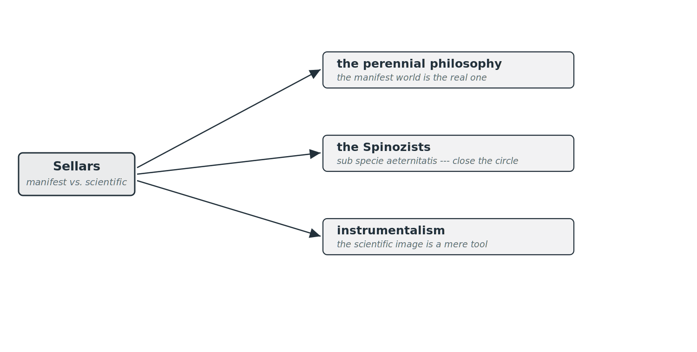{width=95%}

## Responses to Sellars' problem

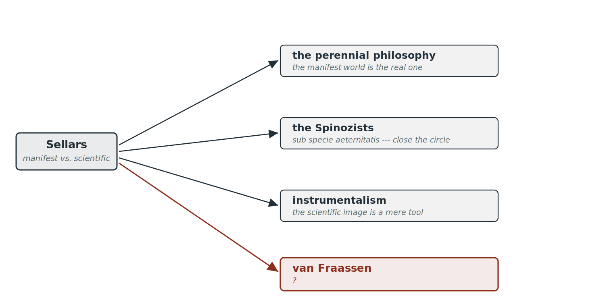{width=95%}

## "The Manifest Image and the Scientific Image"

> there is something much more fundamentally wrong with the entire
> dialectic --- there are no such things as the Manifest and
> Scientific Images at all

> the Scientific Image is as replete with uncashed and ultimately
> uncashable promissory notes as the Manifest Image

## *The Empirical Stance* (2002)

:::: columns
::: {.column width="38%"}
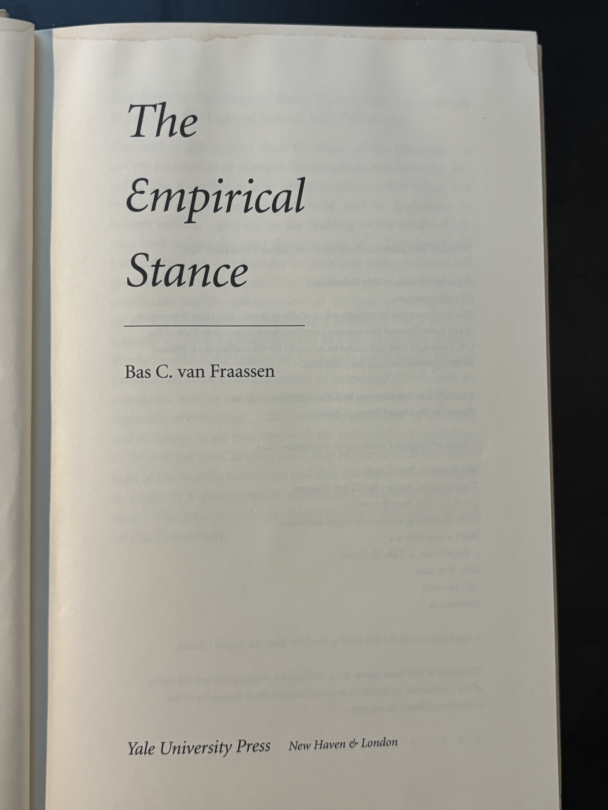{width=100%}
:::
::: {.column width="62%"}
A new term: **objectifying inquiry**

\vspace{0.3cm}

not a proposition, not a theory, not a worldview, not an *image* ---

[it is an activity, something we *do*]{.alert}

\vspace{0.3cm}

Bas ventures past the static categories of analytic philosophy
:::
::::

## Characteristics of objectifying inquiry

It **delimits its object in advance** ---
the domain fixed, the parameters of relevance pre-set.

\vspace{0.3cm}

The result: a model that represents the target,
with the inquirer removed from view.

\vspace{0.3cm}

*But to delimit an object is already to perform an act of
objectification* --- [and the Danes drew the consequence.]{.alert}

::: {.notes}
- Van Fraassen's cluster (What Is Science?, p.156ff): domain pre-defined; parameters of relevance pre-set; demand to postulate gap-filling factors; product is a selective/approximate model.
- The hinge: "delimited in advance" = Nielsen's *act of objectification*. Van Fraassen says science delimits its object; Nielsen says every cognition does, and so every object is relative to the act that delimited it.
- So the delimiting that ENABLES objective inquiry is what BOUNDS it: no final view-from-nowhere, because another act could delimit differently. = Nielsen's frame-relativity = Bohr's movable cut.
- This is a SECOND bridge to the Danes, through objectifying inquiry itself (not through the non-objectifying cases). Stronger: the limit is present in ordinary science, not just special cases.
:::

## Inquiry without objectification

van Fraassen: *are there nonobjectifying forms of inquiry?*

\vspace{0.3cm}

> we do have concrete, recognizable instances of other
> cognitively significant approaches

\vspace{0.3cm}

systematic, cognitive --- and [not objectifying]{.alert}

::: {.notes}
- His own examples: Aristotle's *Poetics* (tragedy reveals deeper truths than history); radically new art ("this is not art!" → a learning experience); the spiritual journey (Augustine, Bunyan, Loyola); empathy for another person.
- The mark: "the domain is not pre-defined, the parameters ... are not pre-set" --- and this lack is *not a defect*.
- Note: his cases are poetry, art, religion, the *other* person. He does NOT name introspection. That case is mine to add --- in the Danish section.
:::

# The Danish road 

## Hegel

:::: columns
::: {.column width="25%"}
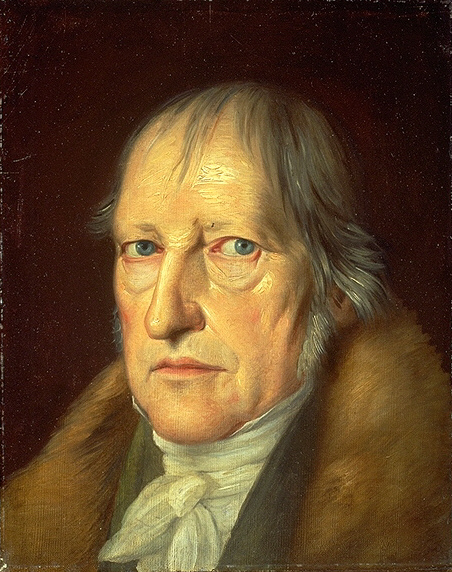{width=100%}
:::
::: {.column width="75%"}
The most ambitious circle-closer of all:
the System absorbs everything --- nature, history, the knower ---
leaving no remainder, no standpoint outside.

\vspace{0.3cm}

Hegel, Boyd, Putnam, Churchland --- the Borg of the System.

\vspace{0.2cm}

And its deepest claim: [there is no choice. Science does not ask;
it states what is, and you are compelled.]{.alert}
:::
::::

::: {.notes}
- Precision: Hegel was not a scientistic naturalist (Vernunft above Verstand). The parallel is FORMAL --- the totalizing ambition to a system with no outside, no remainder, no free standpoint. Same family as the earlier Spinozists.
- Boyd is on the slide because van Fraassen names him in his own lecture --- signals to the specialists exactly whom he fought.
- THE KEY POINT (sets up the whole close): the totalizer's move is about FREEDOM. Putnam: relativity *forces* the block universe on you, no choice. Hegel: the System unfolds by necessity, your "choice" already absorbed. There is no room to *tilegne* --- to take knowledge up freely as one's own.
- This is what van Fraassen AND Kierkegaard refuse: not the science, but the compulsion. Voluntarism (vF) and the existing individual who must choose (SK) = the same insistence on a free, appropriating subject.
- Pays off at the close: aufheben bounds knowledge so the free, practical, appropriating subject has primacy. "Make room for faith" -> make room for FREEDOM, for tilegne over submission.
:::

## Key epistemological moves of Kierkegaard

:::: columns
::: {.column width="25%"}
{width=100%}
:::
::: {.column width="75%"}
The speculative philosopher has forgotten himself

> The thinker who can forget in all his thinking also to think that he is
> an existing individual, will never explain life.

\vspace{0.2cm}

He attempts [to cease to be a human being, in order to become
a book or an objective something]{.alert} --- possible only for a Münchausen.
:::
::::

## Key epistemological moves of Kierkegaard

The human knower is always still *becoming* ---

facing the future, through action; never *sub specie aeterni*

> Is he himself *sub specie aeterni*, even when he sleeps, eats,
> blows his nose ...?

\vspace{0.2cm}

And is ceasing to exist, to stand outside time, something that
*happens* to him --- or [a decision of the will]{.alert}?

## Key epistemological moves of Kierkegaard

Two ways of inquiry

\vspace{0.2cm}

the **objective** way --- toward a result one can detach and write down

the **subjective** way --- toward a truth one can only appropriate

## Key epistemological moves of Kierkegaard

Every inquiry has its mood --- its *stemning*

\vspace{0.3cm}

The wrong mood falsifies its object.

["Indifferent scientificity" is not the absence of a mood --- it is one.]{.alert}

## Rasmus Nielsen (1809--1884)

:::: columns
::: {.column width="25%"}
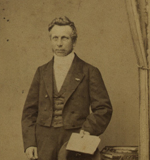{width=100%}
:::
::: {.column width="75%"}
Kierkegaard's mantle → philosophy of science

\vspace{0.2cm}

**objektiveringsloven** --- the law of objectification

> there is no object without a corresponding act of objectification

\vspace{0.1cm}

Against Kant's *fixed* critical boundary: the line between subject
and object is [renegotiated in every act of cognition]{.alert}
:::
::::

## Nielsen: one substrate, many objectifications

the same $X$ yields different objects under different frames:

$X \;\longrightarrow\; O_A,\; O_B,\; O_C$

\vspace{0.2cm}

not a failure of objectivity --- its very structure

\vspace{0.3cm}

Nielsen's word for it: *Vexelvirkning* --- **interaction**

[the term Bohr will reach for in quantum measurement]{.alert}

## Harald Høffding (1843-1931)

:::: columns
::: {.column width="25%"}
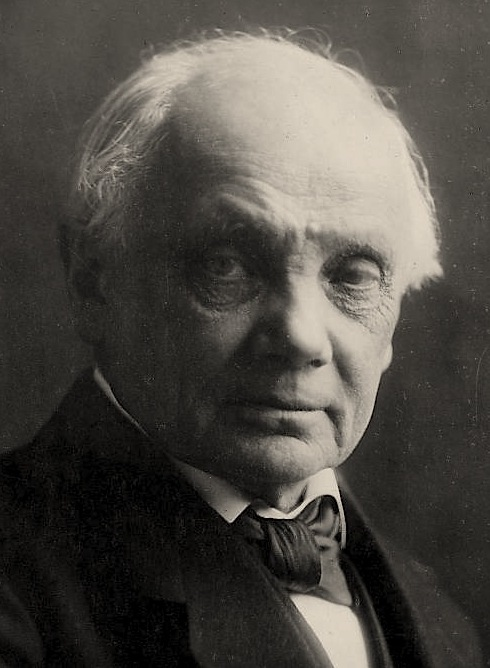{width=100%}
:::
::: {.column width="75%"}
Høffding inherits Nielsen's law almost word for word.

> The subject is the Archimedean point in the theory of cognition ---
> the point from which existence cannot be moved, but only
> apprehended. And such a point must always be presupposed.

\vspace{0.1cm}

No pure object, no pure subject --- only $S_o$ and $O_s$.
[Neither can be eliminated.]{.alert}
:::
::::

## Høffding: the case Bas does not name

Van Fraassen looks outward --- art, the spiritual journey, the *other*
person.

\vspace{0.3cm}

I would add the case where non-objectification is *structural*:
[introspection]{.alert}.

> I think that I think of my thinking ... and divide myself into an
> infinitely retreating succession of egos observing each other (Poul
> Møller, *Tale of a Danish Student*, 1843)

The subject cannot be both the detached observer *and* part of the
object. The cut can be moved --- never eliminated.

::: {.notes}
- The licentiate is from Poul Møller's *Tale of a Danish Student* (1843) --- which Bohr adored since childhood. Møller → Høffding → Bohr, documented (Jacobsen, "Bohr's Psychological Analogies," 2026 --- written under my guidance).
- KEY precision: Bohr's lesson is NOT "objectivity is impossible." It is that objectivity is always relative to a placement of the subject-object cut, which is movable but ineliminable. Same as Nielsen's "renegotiated in every act" and Høffding's S_o / O_s.
- Bohr's analogy (Jacobsen p.25): introspection : psychology :: observation : quantum physics. Same structure. h-bar != 0 makes the cut unavoidable in physics too.
:::

## Høffding reads Einstein (1921)

The Putnam worry, fifty years early: must one observer be under an
*illusion*?

> each observer has his own system of measurement, which is just
> as legitimate as another's

\vspace{0.2cm}

Not the manifest image destroyed --- the observer made
[necessary]{.alert}. No description without a describer.

\vspace{0.2cm}

And inquiry is *led ever further* --- a *plus ultra* --- rather than
closing off. [Knowledge carried beyond itself.]{.alert}

::: {.notes}
- Source: Høffding, *Relation som Kategori* (1921), §3d.δ "The New Theory of Relativity," pp. 72--76 (my translation).
- DIRECT refutation of the Putnam slide from the opening. Putnam: relativity proves the present an illusion. Høffding: relativity proves NO observer is under an illusion --- each frame legitimate, the manifest apprehension relativized and preserved, not destroyed.
- "Take account of the observer's presuppositions" --- the subject made necessary, not eliminated. Same insight as Copernicus, Mach, and (next) Bohr. The Danish road reaches Einstein, not just Bohr.
- The *plus ultra* / "every thought points beyond itself" = aufheben: knowledge carried beyond, inquiry opened not closed. Ties to the closing slide.
- Høffding: "if Einstein is right, one need not therefore philosophize in a new way" --- because the relational insight was always there. Say aloud if time.
:::

## Niels Bohr

:::: columns
::: {.column width="25%"}
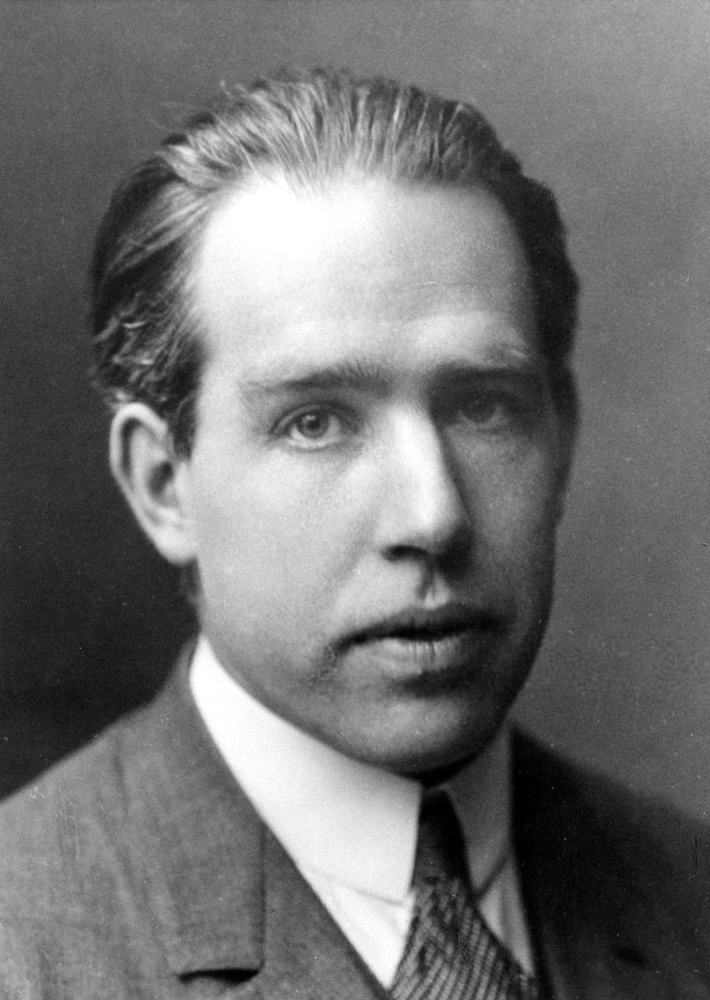{width=100%}
:::
::: {.column width="75%"}
Høffding's student --- his chapter title becomes Bohr's thesis:

> the relation between subject and object forms the core
> of the problem of knowledge

\vspace{0.2cm}

The epistemological lesson: to describe objectively, renounce the
["description from nowhere."]{.alert}

Every description splits the world into describer and described ---
and holds for the context that split creates.
:::
::::

## Why the describer cannot step outside

Because $\hbar \neq 0$, the describer is *entangled* with the described.

\vspace{0.3cm}

Like a journalist caught up in the protest she is covering ---

her entanglement is what prevents a detached, objective account.

\vspace{0.3cm}

[The clean separation of self from object is exactly what fails.]{.alert}

## Two roads to Bas

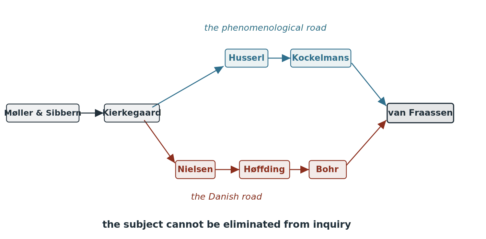{width=95%}

# Back to Bas's mission

## Ich musste das Wissen aufheben

> Ich mußte also das Wissen aufheben, um zum Glauben Platz zu
  bekommen. (Kant, *Critique of Pure Reason*, Preface B xxx)

not "deny", not "restrict" --- [aufheben]{.alert}: to carry knowledge beyond itself

One enters a *parenthesis* to know objectively --- but is not finished
until, through *double reflection*, the knowledge is brought home
into a self and a life.

*Tilegne*: to appropriate, to make one's own. *Wissen* is a moment, not the telos.

## What is the mission?

Hegel, Putnam: the progress of *Science*

Kierkegaard, van Fraassen: the personal telos of the individual human
being, and science is one of the means.

\vspace{0.4cm}

Science is better when whole human beings do it.
[Bohr. Einstein. Schrödinger. Noether.]{.alert}

\vspace{0.4cm}

Like Høffding before him, Bas has prepared the ground ---
for the humans who will do science next.
