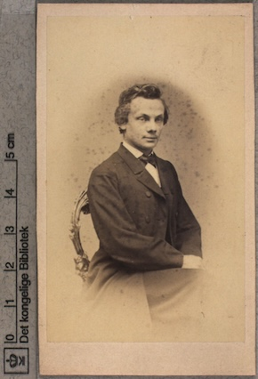
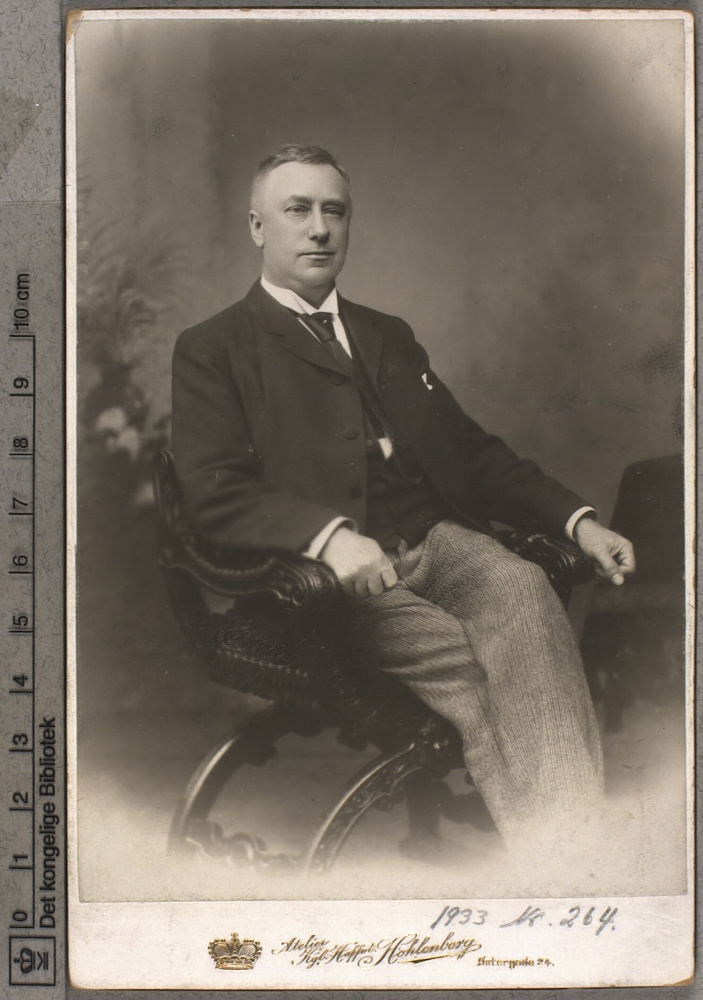
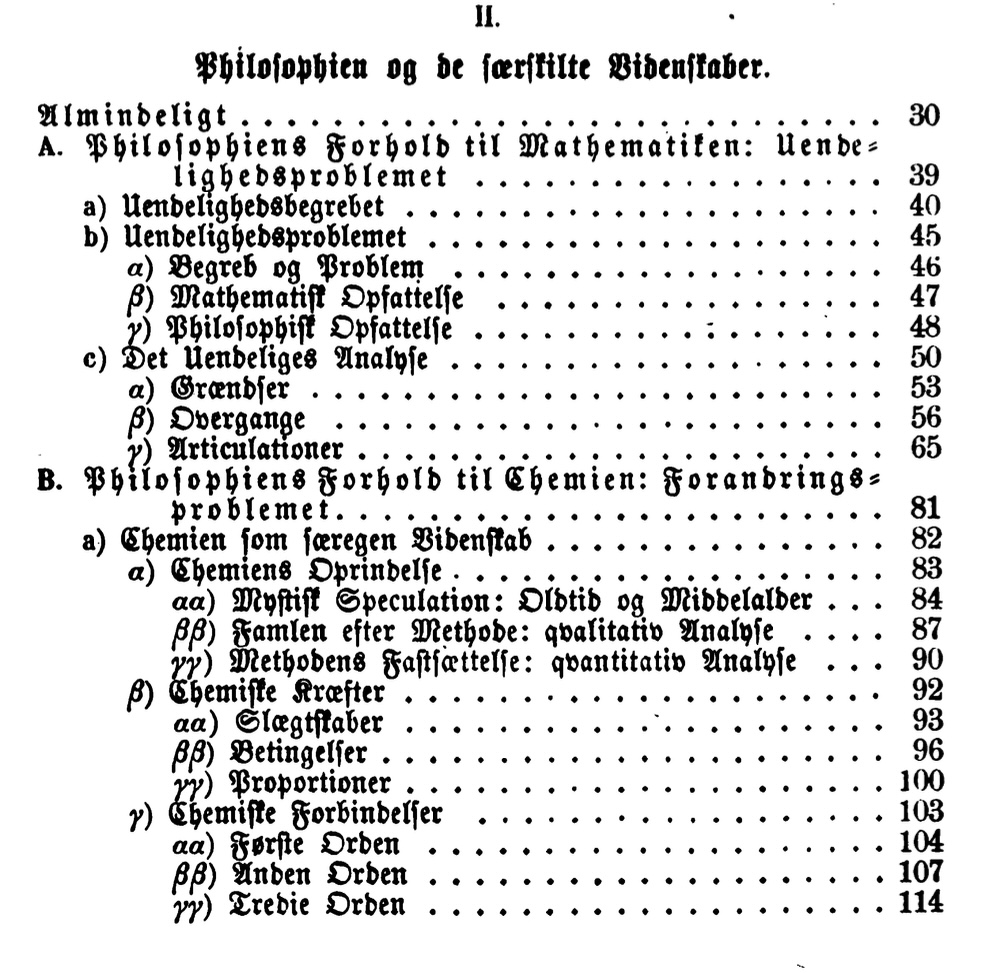
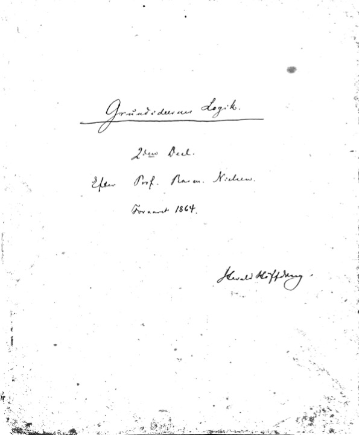
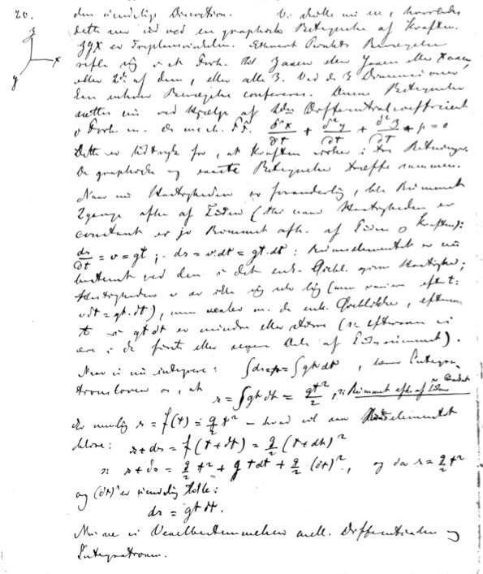
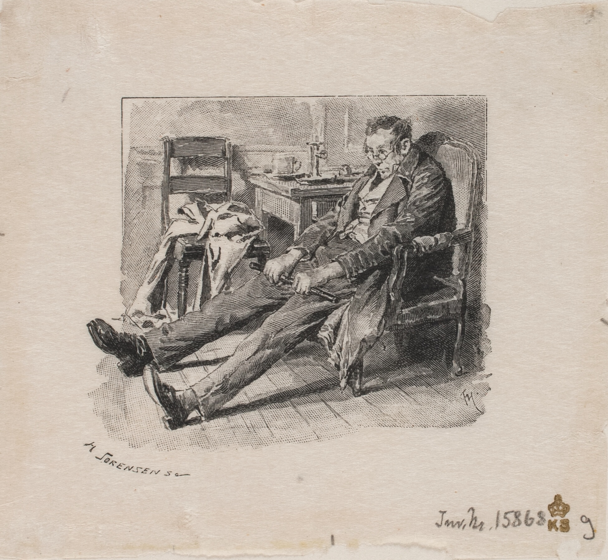

# Introduction

## Introduction

## Introduction

- Rasmus Nielsen was a 19th century philosopher from Copenhagen whose
  work has been completely forgotten.
  
  - If you've heard of him, that's probably because he's mentioned in
    some Kierkegaard biographies.
  
- Not a single page of thousands that Nielsen wrote has been
  translated to another language.
  
- I will begin by explaining reasons to be interested in Nielsen ---
  not just for historians, but also for contemporary philosophers.
  

# Nielsen's relevance 

## Four reasons to be interested in Nielsen 

1. Kierkegaard

2. Niels Bohr

3. Nielsen upsets standard narratives about the origins of analytic
   philosophy

4. Nielsen has an interesting view about faith and reason

## Kierkegaard

- Nielsen's relevance for Kierkegaard studies is described well in Jon
  Stewart, "Rasmus Nielsen: From the object of 'prodigious concern' to
  a 'windbag'"
  
- Nielsen deserves most credit for transmitting SK's ideas to
  subsequent generations (Brandes, Høffding, etc.)

- Nielsen is "patient zero" for reception and transformation of SK's
  ideas
  
  - Both Brandes and Høffding got to know about Kierkegaard from
  Nielsen's lectures  

- Nielsen's career runs parallel with H.L. Martensen's

  - If Martensen was between SK and Hegel, then Nielsen was between SK
    and Martensen

## Bohr

- My project began with wanting to make sense, philosophically, of
  contemporary physics. What do all of these new discoveries mean for
  us?
  
- Niels Bohr had wrestled with such questions more than anyone else

- But contemporary philosophers are either uninterested in Bohr, or
  say that they cannot make sense of him, or say that he was obviously
  wrong
  

## Bohr did have one defender 

## Favrholdt makes explicit what Bohr left implicit 

## Niels Bohr in context 

- Contemporary philosophers accuse Bohr of being a logical positivst
  
- Others have claimed that he is Kantian
  
- But Denmark has its own philosophical tradition that doesn't fit
  neatly into the "world historic" classification scheme

- I was struck by thematic similarities between Bohr's philosophy and
  Kierkegaard's
  
  - But no *direct* influence from Kierkegaard to Bohr
  
  
## Niels Bohr in context 

\begin{tikzcd}[ampersand replacement = \&]
	\&\&\&\& \text{H. Høffding} \\
		\text{Kierkegaard} \&\& \text{Nielsen} \&\&\&\& \text{N. Bohr} \\
	\&\&\&\& \text{Ch. Bohr}
	\arrow[from=2-1, to=2-3]
	\arrow[from=2-3, to=1-5]
	\arrow[from=2-3, to=3-5]
	\arrow[from=1-5, to=2-7]
	\arrow[from=3-5, to=2-7]
\end{tikzcd}

## Challenging the dominant narrative

- At a given moment in history, philosophers from prevailing cultures
  tend to see the history of philosophy as leading up to them
  
  - Hegel
  
  - Reichenbach. *The Rise of Scientific Philosophy*
  
  - Anglo-american philosophy
  
- Specific example: W.v.O. Quine as finally dismantling the
  analytic-synthetic distinction
  

0 Hume $\to$ Carnap $\to$ W.v.O. Quine

1 Hume $\to$ Kant $\to$ Carnap $\to$ Quine 

1.1 Hume $\to$ Kant $\to$ Cassirer $\to$ Carnap $\to$ Quine

1.1.1 $\cdots \to$ Hegel $\to$ Cassirer $\to$ Carnap $\to$ Quine

1.1.1.1 $\cdots \to$ Hegel $\to$ Russell $\to$ Carnap $\to$ Quine

## Challenging the dominant narratives 

- These narratives portray the development as linear. E.g. the
  positivists make philosophy scientific, and then Quine shows that is
  not quite scientific enough
  
- Compare and contrast the Danish *opgør* with Hegel with the English
  (Russell and Moore), which gave birth to analytic philosophy
  
  - The English response doesn't have much religion in it
  
  - Both reject monism in favor of pluralism
  
  - The Danish response leads more quickly to a new kind of philosophy
    of nature
  
- Nielsen's philosophy has several things in common with
  neo-kantianism

  - The relativized apriori
  
- Nielsen offers a distinctly modern conception of the relationship
between philosophy and the natural sciences

# Timeline

## Early life

1809 *bondefødt* i Roerslev, Middelfart

1820s intellectual talents recognized by local priest

> 1830 SK begins at KU

1832 graduated Viborg katedralskole

1837 passed teologisk embedseksamen

## University years 

> 1839 SK remarks satirically about RN in his journal

1840 defended PhD thesis: De speculativa historiæ sacræ tractandæ
methodo

> 1841 SK submits *Begrebet Ironi*

1841 appointed chair of moral philosophy (Poul Møller's chair)

1842 SK remarks satirically about RN's unfinished system in
*Fædrelandet*

## Relationship with Kierkegaard 

1846 *Afsluttende Uvidenskabelig Efterskrift*

1848 SK and RN begin taking regular walks together. Brøchner reports
SK as saying that RN is the only one of the younger thinkers in
Denmark who "may amount to something"

1849 RN. *Evangelietroen og den moderne Bevidsthed* 

> SK: "The writings are plundered in many ways ... And then my
> conversations!"

## Relationship with Kierkegaard 

1849 Martensen. *Den Christelige Dogmatik*

1849 RN. *Mag. S. Kierkegaards "Johannes Climacus" og
Dr. H. Martensens "Christelige Dogmatik." En undersøgende Anmeldelse.*

1850 RN. *Evangelietroen og Theologien*

## The scientific turn 

1855 *Om Theologiens Naturbegreb med særligt Hensyn til Malebranche:
De la recherche de la vérité*

- I haven't been able to study this closely enough to tell if it shows
signs of Nielsen's scientific turn

- By 1857, he had self-studied mathematics enough to write a little
  book
  
  *Philosophie og Mathematik. En propædeutisk Afhandling*
  
- This book was criticized for being dilettantish

## The scientific turn 

- By 1860, Nielsen had self-studied some chemistry, physics, and
  physiology  

> [1] As my recent writings show, it has been my goal, for a number of
> years, to clarify and demonstrate the relationship between
> philosophy and the separate sciences as comprehensively as
> possible. The future of philosophy depends in an essential way on a
> thorough understanding and accurate determination of this
> relationship. (1864, p 18)

## The second battle about faith and reason 

- The first battle between faith and reason: the flareup between
  Martensen and Nielsen at the beginning of the 1850s
  
- The younger generation was decidedly less religious: Brøchner,
  Brandes, etc.  

- In *Grundideernes Logik* (1864), Nielsen had declared that "Faith
  and Reason are different kinds of principles" ("Tro og Viden er
  uensartede Principper")

> [2] But the assumption of duæ veritates ceases to denote a dispute
> between Reason and Revelation, or between Philosophy and Religion,
> when it is realized that the two different truths belong to two such
> different spheres, that what is decided in the one must be left
> undecided in the other. (1864, p 23)

## The (second) battle about faith and reason 

1866 Brandes. *Dualismen i vor nyeste Philosophie*

Høffding

TO DO: Look in Koch

## The teacher 

- Nielsen and Sibbern alternated teaching "det indledende filosofikum"
(introductory philosophy course) for many years

  - This course was mandatory for all first-year students at the
    university, in any subject

- Circa 1860, students complaining that Nielsen demanded too much
knowledge of math and science.

> At first it was Rasmus Nielsen, whose enthusiastic references to
> Kierkegaard and whose rousing eloquence had the greatest influence
> on me. (Høffding 1909)

> No one who studies the life of the mind in nineteenth-century
> Denmark, will be able to skip over [Nielsen's] great philosophical
> writings, and everyone who got to hear his lectures at the
> university will remember him as a great awakener and a rare
> personality. (Brandes 1899)

## The teacher 

  

 

## The teacher 

## The teacher

## The teacher

## The teacher 

## The teacher

# Philosophical themes

## Hegel refresher

- Elimination of distinction between subject and object (solution to
  post-kantian skepticism)
  
- Elimination of distinction between reality (*virkelighed*) and
  concept (*begreb*)
  
  - The real is the rational, and the rational is the real

- Elimination of distinction between reason and cause 

  - Insofar as science is rational, it is subsumed by philosophy

## Kierkegaard's critique of (Hegelian) objectivity 

- No decision without subjectivity

- No god's eye view (for humans)

# Nielsen's Theistic Logic Program

Nielsen: Only Theism prevents collapse to idealism or dogmatism

> Saalænge Forholdet imellem den reflecterende Subjectvitet og den
> objective Verden eensidig fastholdes under Endelighedens Synspunkt,
> vil al vor Begriben og Erkjendelse idelig vakle imellem a) en
> kritisk Idealisme paa den ene og b) en mystisk Realisme paa den
> anden Side. (1845, p 205)

## Empiricism 

- Both by example and in word, Nielsen supported the empirical
  sciences
  
- The anti-logical  
  

## Objectivity

Nielsen rejects the Hegelian aspiration for presupposition-free
knowledge

> From subjective presuppositions proceed objective consequences, and
> from objective consequences, objective knowledge. (1880, p 44-45)

## Subject and Object 

- Puzzlement: Bell and Mermin

- Koch 

- Rosenberg

- Nielsen citations?

- Favrholdt on subject-object?

- Møller citation

## Subject and Object

## Subject and Object 

> Every unambiguous communication about the state and activity of our
> mind implies of course a separation between the content of our
> consciousness and the background loosely referred to as "ourselves",
> but any attempt at exhaustive description of the richness of
> conscious life demands in various situations a different placing of
> the section between subject and object.
>
> In order to illustrate this important point, I shall quote a Danish
> poet and philosopher, Poul Martin Møller, who lived about a hundred
> years ago and left behind an unfinished novel called "The Adventures
> of a Danish Student", in which the author gives a remarkably vivid
> and suggestive account of the interplay between the various aspects
> of our position ... (Bohr 1960, p 65)

## Subject and Object 

## Subject and Object

> Actually, ordinary language, by its use of such words as thoughts
> and sentiments, admits typical complementary relation between
> conscious experiences implying a different placing of the section
> line between the observing subject and the object on which attention
> is focussed. We are here presented with a close analogy to the
> relationship between atomic phenomena appearing under different
> experimental conditions and described by different physical
> concepts, according to the role played by the measuring
> instruments. In fact, the varying separation line between subject
> and object, characteristic of different conscious experiences, is
> the clue to the consistent logical use of such contrasting notions
> as will, conscience and aspirations, each referring to equally
> important aspects of the human personality. (Bohr 1953, pp 389-390)

## Subject and Object 

> In emphasizing the necessity of paying proper attention to the plac-
> ing of the object-subject separation in unambiguous communication,
> the modern development of science has created a new basis for the
> use of such words as knowledge and belief. (Bohr 1955, p 61)

## Subject and Object 

Nielsen claims that the boundary between apriori and aposteriori is
moveable.

> But when the boundary between apriori and empirical is supposed to
> be conceived of as definite and exact, then troubles arise. (1880, p
> 30)

> A fixed, unmovable boundary line between the apriori and aposteriori
> cannot be set. (1880, p 37)

## Subject and Object 

**Objectiveringslov**

> [3] No Object without a corresponding Objectification; it is an a
> priori law that underwrites all empiricism, a basic law that in
> science is, if possible, even more unshakable than Newton's law of
> gravity. From this it can be seen, that a critical boundary, a
> boundary line, on whose one side we have the objectivizing
> subjectivity, while the object is standing on the other side, is
> confusing and meaningless. (1880, p 41)

## Subject and Object

> Her fremsætter Nielsen den «Objektiveringslov», som senere blev et
> saa betydningsfuldt Led i hans Metafysik: Objekterne kan ikke
> objektivere sig selv, og da Objekter uden Objektivering er umulige,
> forudsætter Objektiviteten en objektiverende Subjektivitet. Paa den
> anden Side kan Subjektiviteten ikke undvære Objektiviteten, eftersom
> dens Selvbegriben og Selvmagt saa vilde blive uden Indhold. Opfatter
> vi Forholdet udialektisk faar vi en kriiisk Adskillelse som hos
> Kant, der ganske fornagler Problemet om Subjektets og Objektets
> indbyrdes Forhold, eller en mystisk Realisme som hos Schelling, der
> fortoner Problemet i Taage. Men naar Objektiviteten og den bærende
> Subjektivitet paa ethvert Punkt dialektisk ses at forudsætte
> hianden, da forstaas «Naturens aandrige Aandløshed», og man øjner
> Muligheden af Problemets Løsning --- saavidt muligt er paa
> menneskelige Vilkaar. (Rosenberg p 13)

## Subject and Object 

> [4] Nielsen imagined that to describe the interrelationship between
> the subjective and the objective, or as he calls it, knowledge and
> power, an infinite analysis would be needed, since every subject
> presupposes an object, and every object in turn a subject. When one
> does not want to conclude in a speculative and theological way, it
> becomes a duel without end.

# Subject and Object 

> ... Nielsen did not perceive the matter in this way. His way of
> thinking was that since every object must be objectified,
> i.e. presupposes a subject, and since the human subject cannot
> perceive (objectify) everything, there must, if the reality of
> objects is to be asserted, be an absolute ('ontological') subject
> for whom the absolute reality exists. 

## Subject and Object 

> He overlooks the fact that the game must begin again here; even a
> God would be bound to the Law of the Relation between Subject and
> Subject and Object. The attempt to justify an abstract theism
> through *Grundideernes Logik* has therefore not succeeded. We could
> not get further than to determine and describe a subject in relation
> to which certain phenomena (objects) apply, just as the astronomer
> must determine a point (on the earth, on the sun, or wherever) from
> which the positions and movements of the celestial bodies could be
> described as if they were absolute. (Høffding 1909, p 189-190)

  

## Viden og Magt

- Even in his early work, Nielsen argued that creation was an act of
  will (demonstration of power) by God
  
A being with complete knowledge must also have complete power.

> If there is a complete knowledge, then it cannot be sensory; it must
> get a grip on the realities in a completely unique way, namely by
> the fact that it originally brings them forth. (1880, p 60)

## Mechanism versus Vitalism

Nielsen denies the existence of a special life substance

> A scientifically conducted physiology must necessarily lead to the
> result that there is no "life force" distinct from nature's ordinary
> forces. (1862, p 187)

Nielsen endorses methodological naturalism

> The deeper science penetrates into some state of affairs, all the
> more clear it becomes that these challenges in their parts as on the
> whole, in the smallest as in the largest, are solved in a natural
> way and by natural means. (1862, p 187)

## Faith and Reason

- Nielsen refers to Darwin's *Origin of Species* in his 1861 lectures
  --- the first reference in the Danish literature
  
- "Et synspunkt for Darwinisme" (1873). Nielsen argues that accepting
  Darwinian evolution is fully consistent with Christian doctrines of
  creation, fall, etc.

## Philosophy of Science

Nielsen rejects the idea of a single absolute science.

> What Schelling calls "science itself" cannot possibly survive "the
> sciences" (1880, p 72)

> That each distinct science must have its distinct starting point,
> conditional upon substance on topic, follows from the nature of the
> matter. (1880, p 89)

## Was Rasmus Nielsen the first analytic philosopher?

- circa 1900: Bertrand Russell and G.E. Moore reject Cambridge
  Hegelianism
  
- circa 1915: Wittgenstein reads Kierkegaard 

  - "language on holiday"
  
- The logical positivists argue that philosophy has no content of its
  own; instead, it is to be the logic of science

# Conclusion

## Open questions: backward 

- Low-hanging fruit in research on 19th century Danish philosophers
  
  - Reading and interpreting Nielsen's books is a big job: Danish,
    fraktur, mathematics, etc.
  
  - Nielsen's handwritten papers in KB
  
  - Notes by students in KB
  

- Can we say something more specific about what triggered Nielsen's
  turn to *fagvidenskaberne*?
  
  - The timeline between 1853 and 1860 is a bit hazy

## Open questions: backward

- What role does the concept of power (*Magt*) play for Martensen and
  Nielsen?
  
- The notion of "objectivering" appears in *Den Propædeutiske Logik*
  (1845). Does it appear elsewhere before that?  
  
- Did Nielsen know about non-euclidean geometry, and did that
  influence his view about the moveable apriori?   

## Open questions: forward

- Does RN represent a betrayal of SK's ideas, or an innovative
  application of these ideas to a life with more typically modern
  concerns?
  
- Does RN provide a positive development of SK's conception of the
  role of objective knowledge in a good human life?
  
  - A competitor to the views of Spinoza and Hegel

- Does RN have some good ideas about the relationship between
  theology, philosophy, and science?

## Further reading 

- Jon Stewart. "Rasmus Nielsen: From the object of 'prodigious
  concern' to a 'windbag'" (The only thing in English!?)

- Carl Henrik Koch. *Den Danske Idealisme* [chapter on Nielsen]

- Harald Høffding. *Danske Filosoffer* [chapter on Nielsen]

